Quantum arithmetic operations
================

We demonstrate building some quantum arithmetic operations using basic gates. Some operations would be used in other quantum algorithms, such as Shor's algorithm.

* [Adder](#add)

* [Subtractor](#sub)

* [Carrier](#car)

* [Multiplier](#mul)

* [Modular adder](#modadd)

* [Modular multiplier](#modmul)

* [Modular exponentiation](#modexp)


</br>
<h2 id = "add"></h2>

Adder
--------------------
We will present two quantum adders based on the *ripple-carry* approach, i.e., starting from low-order bits of the input and working our way up to the high-order bits. We assume the inputs are \(a=a_{n−1}\cdots a_0\) and \(b=b_{n−1}\cdots b_0\), both with \(n\) qubits and 0 is the lowest-order bit. The adder transfers
\[|a\rangle|b\rangle\rightarrow|a\rangle|a+b\rangle\]

First, we show a basic design. It relies on two major components: a majority (MAJ) gate and an *UnMajority and Add* (UMA) gate. They make a 1-bit full-adder together.

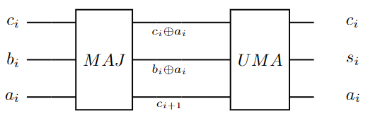

These two components can be built with CNOT and Toffoli gates easily:

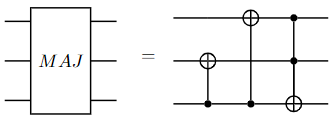
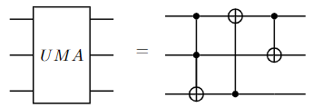

It follows that we can string together MAJ and UMA gates to build a ripple-carry adder. Below is a 3-bit adder


Note that the first qubit is ancillary. The isQ code implementing this adder is
```c++
/*
* Majority gate
*
* |a_i>|b_i>|c_i> -> |c_{i+1}>|b_i^a_i>|c_i^a_i>.
* when the inputs contain two or three 1s, c_{i+1} = 1; otherwise, 0.
*/
procedure maj(qbit a, qbit b, qbit c) {
    CNOT(c, a);
    CNOT(c, b);
    Toffoli(a, b, c);
} deriving gate

/*
* UMA (UnMaj-and-Add) gate
*
* |c_i^a_i>|b_i^a_i>|c_{i+1}> -> |c_i>|s_i>|a_i>
* s_i is the addition result of a_i, b_i, and c_i.
*/
procedure uma(qbit ca, qbit ba, qbit c)
{
    Toffoli(ca, ba, c);
    CNOT(c, ca);
    CNOT(ca, ba);
} deriving gate

/*
* 3-bit adder
* |a>|b> -> |a+b>|a>
*/
procedure adder3(qbit a0, qbit a1, qbit a2, qbit b0, qbit b1, qbit b2) {
    qbit anc;
    maj(anc, a0, b0);
    maj(b0, a1, b1);
    maj(b1, a2, b2);

    uma(b1, a2, b2);
    uma(b0, a1, b1);
    uma(anc, a0, b0);
} deriving gate
```
The keyword `deriving gate` transfers a procedure into a gate so that it can be decorated with `ctrl` and `inv`.

Above adder design can be optimized to improve scalability. One of the more efficient designs is shown below

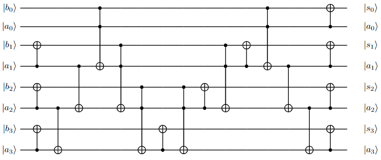

Note that this design does not require any ancillary qubit. We write an isQ procedure for this design

```c++
procedure __add(qbit a[], qbit b[])
{
    int len = a.length;
    CNOT(a[1:len], b[1:]);
    CNOT(a[len-2:0:-1], a[len-1:0:-1]);
    Toffoli(a[0:], b, a[1:len]);
    for i in len-1:0:-1 {
        CNOT(a[i], b[i]);
        Toffoli(a[i - 1], b[i - 1], a[i]);
    }
    CNOT(a[1:], a[2:len]);
    CNOT(a, b);
}
```

We use two `qbit` arrays as parameters. This procedure works with an array of any length. Many gates used in this procedure are *bundle operations*, i.e., operations applied to array elements. For example, `CNOT(a[1:len], b[1:])` means applying `CNOT` gates pair-wise to `(a[1], b[1])`, `(a[2], b[2])`, ..., `(a[len-1], b[len-1])`. This feature of isQ makes programs concise. However, this feature and classical control flow conflict with `deriving gate` because only pure quantum circuits can be decorated.

The second adder design has been adopted as the default adder in the current isQ compiler. It will be called with the form `a += b;` where `a` and `b` are both qubit arrays. For example, the following program will print `3`, `6`, and `1` in sequence.

```c++
import std;
procedure main()
{
    qbit p[3];
    qbit q[3];
    X(p[0:2]); // = X(p[0]); X(p[1]);
    q += p;
    print M(q); // should print 3
    q += p;
    print M(q); // should print 6
    q += p;
    print M(q); // should print 1
}
```

By setting an addend to a constant number, we can turn an adder into a *constant adder*. More formally, a constant adder maps
\[|a\rangle\rightarrow|a+c\rangle\]
where \(c\) is a constant number.

We can implement the constant adder using a regular adder and a simple component *SET* (\(S_c\)). The subscript \(c\) represents the constant number. The set gate is simply some \(X\) gates corresponding to the bit 1s in \(c\). Therefore, its reverse is itself.

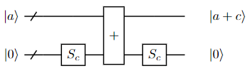

For example, an increment gate can be seen as a constant adder where \(c=1\). We implement it in isQ:
```c++
procedure add1(qbit a0, qbit a1, qbit a2) {
    qbit b0, b1, b2;
    X(b0);
    adder3(a0, a1, a2, b0, b1, b2);
    X(b0);
} deriving gate
```
Note that \(S_1\) is implemented with `X(b0)`.


</br>
<h2 id = "sub"></h2>

Subtractor
--------------------
Subtraction is the dual operation of addition. Therefore, a subtractor is just the reverse of an adder. The following example demonstrates the way of subtracting using an adder.

```c++
import std;
import adder3;
procedure main()
{
    qbit a[3], b[3];

    // Set |a> = |7>
    X(a);

    // Set |b> = |1>
    X(b[0]);

    // |a>|b> -> |a-b>|b>
    inv adder3(a[0], a[1], a[2], b[0], b[1], b[2]);

    print M(a);     // should be 6
    print M(b);     // should be 1
}
```

Similarly to addition, isQ supports using `-=` as the short form of calling the subtraction procedure.


</br>
<h2 id = "car"></h2>

Carrier
--------------------
A special gate named *Carrier* is helpful for gates such as the modular adder. It computes
\[|a\rangle|b\rangle|0\rangle\rightarrow\left\{\begin{array}{l}
|a\rangle|b\rangle|0\rangle\text{ if }a+b<2^n,\\
|a\rangle|b\rangle|1\rangle\text{ if }a+b\geq2^n,
\end{array}\right.\]
i.e., it only computes whether \(a+b\) leads to a carry without changing the values of \(a\) and \(b\). Therefore, we can use a circuit similar to the adder to implement the carrier gate.

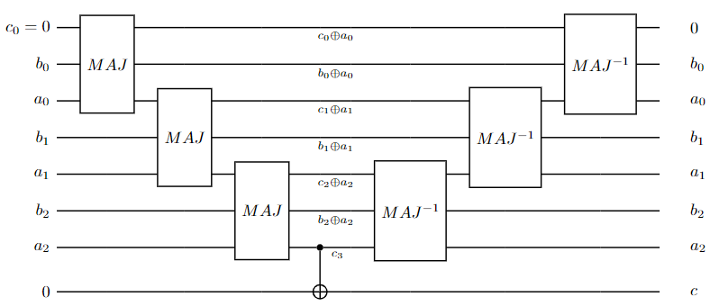

Note that the gate on the right side of the figure is the inverse of \(MAJ\). Thus, \(a\) and \(b\) change back to their initial values. The corresponding isQ code is
```c++
procedure carrier3(qbit a0, qbit a1, qbit a2, qbit b0, qbit b1, qbit b2, qbit c) {
    qbit anc;
    maj(anc, a0, b0);
    maj(b0, a1, b1);
    maj(b1, a2, b2);

    // Copy out the result
    CNOT(b2, c);

    // Uncompute
    inv maj(b1, a2, b2);
    inv maj(b0, a1, b1);
    inv maj(anc, a0, b0);
} deriving gate
```


</br>
<h2 id = "mul"></h2>

Multiplier
--------------------
We use isQ to build a naive multiplier in this section. It implements the following transformation:

\[|a\rangle|b\rangle|c\rangle\rightarrow|a\rangle|b\rangle|c+a\times b\rangle\]

where the lengths of \(a\), \(b\), and \(c\) are \(n\), \(n\), and \(2n\), respectively. The algorithm mimics the way of multiplying binary numbers on paper, e.g.,

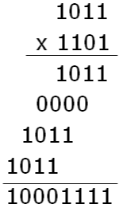

We prepare an ancillary qubit array `anc` as the *scratchpad*, i.e., the memory storing the shifted numbers shown between the two lines in the above figure. The shift operation is implemented using `Toffoli` gates, which can also be seen as the multiplication of two bits. Next, `anc` is added to `c` using an adder. Finally, `anc` is uncomputed to \(|0\rangle\), so the computation continues. The complete program is shown below.

```c++
// |a>|b>|c> -> |a>|b>|c+a*b>
procedure mul(qbit a[], qbit b[], qbit c[])
{
    // Check the length of qubit arrays
    int len = a.length;
    assert(len == b.length);
    assert(len * 2 == c.length);

    qbit anc[len * 2];
    for i in 0:len {
        // anc = b << i
        for j in 0:len {
            Toffoli(a[i], b[j], anc[i + j]);
        }
        
        c += anc;

        // anc = 0
        for j in 0:len {
            Toffoli(a[i], b[j], anc[i + j]);
        }
    }
}
```


</br>
<h2 id = "modadd"></h2>

Modular adder
--------------------
Let us consider a type of *modular adder* that computes
\[|a\rangle\rightarrow|a+c\bmod N\rangle\]
where \(c\) and \(N\) are constant numbers.

One way to implement a modular adder is first to test whether the result is larger than or equal to \(N\). If \(a+c\geq N\), then \(a+(2^n+c-N)\geq2^n\). Therefore, this step can be done by setting ancillary qubits to \(2^n+c-N\) and then applying the carrier gate. If \(a+c\geq N\), we need to add \(c\) to \(a\) and subtract \(N\). It equals adding \(2^n+c-N\). If \(a+c<N\), then we can add \(c\) directly. Finally, we convert the carry bit back to \(|0\rangle\) by calling the carrier gate again. The overall circuit is shown as follows.

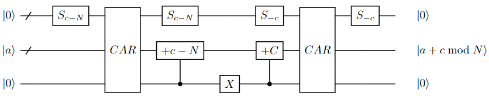

As all the components require at most \(O(n)\) quantum gates, the cost of a modular adder is \(O(n)\).

We implement an example where \(c=1\) and \(N=15\) in isQ:
```c++
// |a> -> |a+1(mod 15)>
procedure add1mod15(qbit a0, qbit a1, qbit a2, qbit a3) {
    qbit b0, b1, b2, b3, c;

    // set b = |2>
    X(b1);

    // Test whether a + 1 >= 15
    carrier4(a0, a1, a2, a3, b0, b1, b2, b3, c);

    // If true, add 1 then subtract 15, i.e., subtract 14, i.e., add 2
    ctrl add2(c, a0, a1, a2, a3);

    // If false, add 1 directly
    X(c);
    ctrl add1(c, a0, a1, a2, a3);

    // Uncompute
    X(b0);
    X(b2);
    X(b3);
    carrier4(a0, a1, a2, a3, b0, b1, b2, b3, c);
    X(b3);
    X(b2);
    X(b1);
    X(b0);
} deriving gate
```


</br>
<h2 id = "modmul"></h2>

Modular multiplier
--------------------
Based on the modular adder, we can build a *modular multiplier*. That is, given an \(n\)-qubit input \(|a\rangle\), we calculate the result \(|a\times c(\bmod N)\rangle\) where \(c\) and \(N\) are constant numbers.

If we express \(a\) in binary form \(a_{n-1}\cdots a_0\), i.e., \(a=\sum_{j=0}^{n-1}a_j2^j\), we can see that
\[a\times c=\sum_{j=0}^{n-1}a_j2^jc(\bmod N)\]
i.e., modular multiplication is a series of modular addition chained together.

This observation motivates us to implement the modular multiplier using the following circuit.
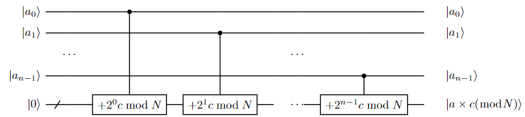

As a modular multiplier contains \(n\) modular adders, the overall cost is \(O(n^2)\).

The following is an isQ implementation where \(c=7\) and \(N=15\). Note that \(7\times2^1=14(\bmod15)\), \(7\times2^2=13(\bmod15)\), and \(7\times2^3=11(\bmod15)\).

```c++
// |a>|0> -> |a>|a*7(mod 15)>
procedure mul7mod15(qbit a3, qbit a2, qbit a1, qbit a0, qbit b3, qbit b2, qbit b1, qbit b0) {
    ctrl add7mod15(a0, b0, b1, b2, b3);
    ctrl add14mod15(a1, b0, b1, b2, b3);
    ctrl add13mod15(a2, b0, b1, b2, b3);
    ctrl add11mod15(a3, b0, b1, b2, b3);
} deriving gate
```

The above implementation keeps input \(a\) unchanged. That is, gate \(MUL_c\) maps
\[|a\rangle|0\rangle\rightarrow|a\rangle|a\times c(\bmod N)\rangle\]
However, a unitary gate \(|a\rangle\rightarrow|a\times c(\bmod N)\rangle\) is preferred sometimes. It can be built with the following circuit

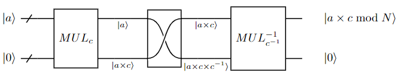
The box in the middle of the figure represents a \(SWAP\) gate, i.e., \(|a\rangle|b\rangle\rightarrow|b\rangle|a\rangle\) Note that \(c\times c^{-1}=1(\bmod N)\), and \(c^{-1}\) does not always exist for any \(c\). Also, it does not always possible to build the unitary form since the modular multiplication may not be reversible. This circuit is implemented with the following isQ program

```c++
// |a>|b> -> |b>|a>
procedure swap4(qbit a0, qbit a1, qbit a2, qbit a3, qbit b0, qbit b1, qbit b2, qbit b3) {
    SWAP(a0, b0);
    SWAP(a1, b1);
    SWAP(a2, b2);
    SWAP(a3, b3);
} deriving gate

// |a> -> |a*7(mod 15)>
procedure mul7mod15_u(qbit a3, qbit a2, qbit a1, qbit a0) {
    qbit anc[4];
    mul7mod15(a3, a2, a1, a0, anc[3], anc[2], anc[1], anc[0]);
    swap4(a3, a2, a1, a0, anc[3], anc[2], anc[1], anc[0]);
    inv mul13mod15(a3, a2, a1, a0, anc[3], anc[2], anc[1], anc[0]);
} deriving gate
```
Note that \(7^{-1}=13(\bmod15)\), i.e., \(7\times13=1(\bmod15)\).


</br>
<h2 id = "modexp"></h2>

Modular exponentiation
--------------------
In a similar way, we can also build modular exponentiation (\(|p\rangle|a\rangle\rightarrow|p\rangle|x^pa(\bmod N)\rangle\)) based on modular multiplication. Assume \(p=\sum_{i=0}^{n-1}p_j2^j\). Then, \(x^p=\prod_{i=0}^{n-1}x^{p_j2^j}\). The corresponding circuit is shown as follows.

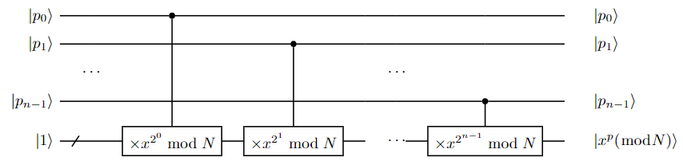

As the above circuit contains \(n\) modular multipliers, its cost is \(O(n^3)\).

We implement such a gate where \(x=7\) and \(N=15\) with isQ:
```c++
// |p>|a> -> |a*7^p(mod 15)>
procedure pow7mod15(qbit p[], qbit a[4]) {
    // 7^(2^0) = 7 (mod 15)
    ctrl mul7mod15_u(p[0], a[3], a[2], a[1], a[0]);

    // 7^(2^1) = 4 (mod 15)
    ctrl mul4mod15_u(p[1], a[3], a[2], a[1], a[0]);
}
```
For bits other than the lowest two, the modular result is always 1, e.g., \(7^{2^2}\bmod15=1\). Therefore, the corresponding modular multiplication gate would be a trivial identical gate.

### Reference
1. Steven A. Cuccaro, Thomas G. Draper, et al. "*A new quantum ripple-carry addition circuit.*" arXiv preprint quant-ph/0410184, 2004.

2. Y. Takahashi, S. Tani, and N. Kunihiro, "*Quantum Addition Circuits and Unbounded Fan-Out.*" arXiv preprint 0910.2530, 2009.

3. D. Beckman, A. Chari, et al. "Efficient networks for quantum factoring." *Physical Review A*, 1996, 54: 1034-1063.

