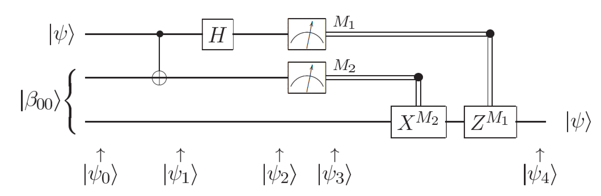
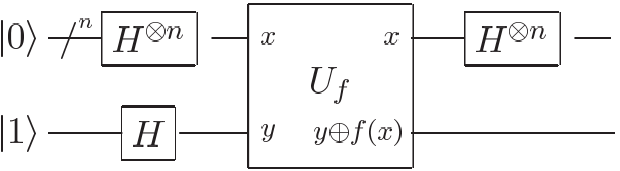

Basic examples
================

We will show you how to write isQ code with some basic examples. For readers interested in the algorithm details, please refer to the textbook *Quantum Computation and quantum information* written by M.A. Nilsen and I. Chuang. All the examples can be found in the *examples* folder in isQ open-source code [repository](https://github.com/arclight-quantum/isQ-Compiler).

* [Bell state](#bell)

* [Quantum teleportation](#teleport)

* [Deutch-Jozsa algorithm](#dj)

* [Bernstein-Vazirani algorithm](#bv)

</br>
<h2 id = "bell"></h2>

Bell state
-----------------

The **Bell's states** or **EPR pairs** are specific quantum states of two qubits that represent the simplest (and maximal) examples of quantum entanglement. They can be created using the following circuit:


It can be easily expressed in isQ:

```C++
import std;

qbit a, b;

procedure main() {
    H(a);
    CNOT(a, b);
    print M(a);
    print M(b);
}
```
The measured result should both be 0, or both be 1.

</br>
<h2 id = "teleport"></h2>

Quantum teleportation
-----------------

Quantum teleportation is the transfer of a quantum state over a distance. Alice and Bob share an EPR pair and each took one qubit before they became separated. Alice must deliver a qubit of information to Bob, but she does not know the state of this qubit and can only send classical information to Bob.

It is performed step by step as the following:

1. Alice sends her qubits through a CNOT gate.
2. Alice then sends the first qubit through a Hadamard gate.
3. Alice measures her qubits, obtaining one of four results, and sends this information to Bob.
4. Given Alice's measurements, Bob performs one of four operations on his half of the EPR pair and recovers the original quantum state.
The following quantum circuit describes teleportation:



The corresponding isQ program is as follows:
```C++
import std;
procedure transform(qbit a, qbit b, qbit c){
    // Prepare the EPR pair
    H(b);
    CNOT(b, c);

    CNOT(a, b);
    H(a);

    // Fix up the state based on measurement result
    if (M(b)) { X(c); }
    if (M(a)) { Z(c); }
}
procedure main(){
    qbit q[3];
    Rx(pi/3, q[0]); // Set initial state as 'sqrt(0.75)|0>-sqrt(0.25)i|1>'
    transform(q[0], q[1], q[2]);
    print M(q[2]);
}
```
The measurement result will be consistent with the probability distribution of measuring \(\sqrt{0.75}|0\rangle-\sqrt{0.25}i|1\rangle\).


</br>
<h2 id = "dj"></h2>

Deutsch-Jozsa algorithm
-----------------
The Deutsch–Jozsa algorithm is a deterministic quantum algorithm proposed by David Deutsch and Richard Jozsa in 1992. Although of little current practical use, it is one of the first examples of a quantum algorithm that is exponentially faster than any possible deterministic classical algorithm.

We are given a black box quantum computer known as an oracle that implements some function:
\[f:\{0,1\}^n\rightarrow\{0,1\}\]
The function takes n-bit binary values as input and produces either a 0 or a 1 as output for each such value. We are promised that the function is either constant (0 on all inputs or 1 on all inputs) or balanced (1 for exactly half of the input domain and 0 for the other half). The task then is to determine if \(f\) is constant or balanced by using the oracle.

For a conventional deterministic algorithm, \(2^{n-1}+1\) evaluations of \(f\) will be required in the worst case. However, the quantum solution requires only one evaluation using the following circuit:



Its corresponding isQ program is as follows:

```C++
import std;

oracle bool[1] constant(bool a[4]) {
    bool res[] = {true};
    return res;
}

procedure main()
{
    qbit q[4], anc[1];
    X(anc[0]);
    H(q);
    H(anc[0]);
    constant(q, anc);
    H(q);
    print M(q);
}
```
Note that we defined a constant oracle that returns 1 for all inputs. Therefore, the printed result should be 0.

</br>
<h2 id = "bv"></h2>

Bernstein-Vazirani algorithm
--------------------
The Bernstein–Vazirani algorithm is a restricted version of the Deutsch–Jozsa algorithm where instead of distinguishing between two different classes of functions, it tries to learn a string encoded in a function. The oracle is defined as the function:
\[f(x)=x\cdot s=x_1s_1\oplus x_2s_2\oplus\cdots\oplus x_ns_n\]
where \(s\in\{0,1\}^n\) is a secret string and \(\oplus\) represents addition modulo 2. 

Following the same circuit as the Deutsch–Jozsa algorithm, the measurement result of the first register is a secret string.

We write an isQ program to demonstrate the Bernstein–Vazirani algorithm. We select \(s=1011\) as the secret bitstring and use it to define the oracle `g`. Note that in its definition, \(s\) is defined as a `bool` array, and the addition modulo 2 operation is implemented by the `!=` operator.

```C++
import std;

oracle bool[1] g(bool a[4]) {
    bool s[] = {true, true, false, true};
    bool ba[] = s & a;  // bit-wise AND
    bool res[1];
    res[0] = ba[0] != ba[1] != ba[2] != ba[3];
    return res;
}

procedure main(){
    qbit q[4], res[1];
    X(res);
    H(res);
    H(q);
    g(q, res);
    H(q); 
    print M(q); // should print 11 (=0x1011)
}
```
After execution, the program should print 11, i.e., the secret string \(s\). 
