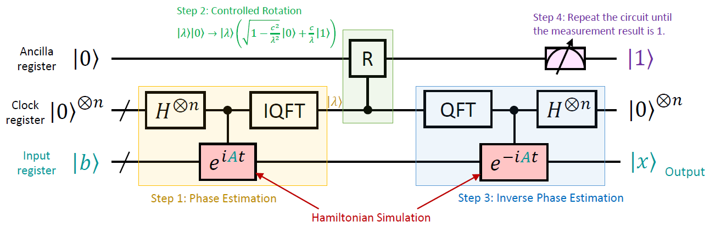
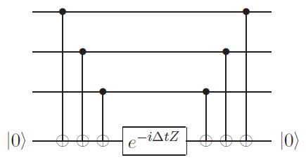

Harrow-Hassidim-Lloyd (HHL) quantum algorithm [1] can be used to solve linear system problems and can provide exponential speedup over the classical conjugate gradient method chosen for this purpose. HHL is the basis of many more advanced algorithms and is important in various applications such as machine learning and modeling of quantum systems.

A linear system problem (LSP) can be represented as the following
\[A\vec{x}=\vec{b}\]
where \(A\) is an \(N_b\times N_b\) Hermitian matrix, and \(\vec{x}\) and \(\vec{b}\) are \(N_b\)-dimensional vectors. For simplicity, it is assumed \(N_b = 2^{n_b}\). \(A\) and \(\vec{b}\) are known, and \(\vec{x}\) is the unknown to be solved, i.e.,
\[\vec{x}=A^{−1}\vec{b}\]

Assume the spectral decomposition of \(A\) is
\[A=\sum_{i=0}^{N_b}\lambda_i|u_i\rangle\langle u_i|\]
where \(\{\lambda_i\}\) and \(\{|u_i\rangle\}\) are the eigenvalues and the eigenvectors of \(A\). Since \(\{|u_i\rangle\}\) are orthogonal, \(|b\rangle\) can also be decomposed onto these basis:
\[|b\rangle=\sum_{i=0}^{N_b}b_i|u_i\rangle\]

Therefore,
\[|x\rangle=A^{-1}|b\rangle=\sum_{i=0}^{N_b}\lambda_i^{-1}b_i|u_i\rangle\]

The HHL algorithm consists of four major steps, as shown as follows



- Step 1: Phase Estimation. Let \(U=e^{iAt}\). Then
\[U=\sum_{j=0}^{N_b}e^{i\lambda_jt}|u_j\rangle\langle u_j|\]
i.e., the eigenvalue corresponding to eigenvector \(|u_j\rangle\) is \(e^{i\lambda_jt}\). Recall that the [quantum phase estimation (QPE) algorithm](../hsp/#qpe) obtains \(N\theta\) for eigenvalue \(e^{2\pi i\theta}\). Therefore, applying QPE with \(U\) gets \(|N_b\lambda_it/2\pi\rangle|u_j\rangle\). We should choose a suitable \(t\) so that \(\tilde{\lambda}_j=N_b\lambda_it/2\pi\) is (close to) an integer. The qubits that hold \(|\tilde{\lambda}_j\rangle\) are usually named the *clock register*.

- Step 2: Controlled Rotation. This step consists of a gate \(R\) that maps
\[\left\{\begin{array}{l}
|\lambda\rangle|0\rangle\mapsto|\lambda\rangle|0\rangle,\text{ if }\lambda=0\\
|\lambda\rangle|0\rangle\mapsto|\lambda\rangle\left(\sqrt{1-\frac{c^2}{
\lambda^2}}|0\rangle+\frac{c}{\lambda}|1\rangle\right),\text{ if }\lambda\neq0
\end{array}\right.\]

- Step 3: Inverse Phase Estimation. We need to uncompute Step 1 to change the clock register back to \(|0\rangle\). Therefore, this step is precisely the inverse of Step 1.

- Step 4: Repeat the Circuit until the measurement result of the ancilla qubit is 1. In this case, the amplitude \(c/\lambda\) merges into the output register, whose final state is
\[\sum_{i=0}^{N_b}\frac{cb_i}{\lambda}|u_i\rangle\]
without normalization. It is the same with \(|x\rangle\) except for a constant \(c\). Thus, the algorithm achieves the goal.

To implement the algorithm, we need to further compose two key gates: Hamiltonian simulation gate \(e^{iAt}\) and rotation gate \(R\). First, we implement the former. Section 4.7.3 of [2] introduces a way of simulating Hamiltonian \(H=Z_1\otimes Z_2\otimes Z_3\):



Based on this idea, we can simulate any Pauli matrices product by changing a Pauli gate to \(Z\). For example, since \(Z=HXH\), we can apply an \(H\) gate before the circuit to change \(X\) to \(Z\). Since any matrix can be decomposed as the sum of Pauli matrices products, i.e., \(A=\sum_jP_j\), then
\[e^{iAt}=\prod_je^{iP_jt}\]
It means that we can simulate each \(P_j\) in sequence, and the overall result is \(e^{iAt}\).

To implement \(R\), we separate it into \(2^{n_c}-1\) control gates where \(n_c\) is the number of qubits in the clock register. More specifically, when the clock register is \(|\lambda\), we apply a \(R_y(\theta)\) gate to the ancilla qubit, where \(\theta=2\textrm{arcsin}(c/\lambda)\). Note that
\[R_y(\theta)=\begin{bmatrix}
\textrm{cos}\frac{\theta}{2} & -\textrm{sin}\frac{\theta}{2}\\
\textrm{sin}\frac{\theta}{2} & \textrm{cos}\frac{\theta}{2}
\end{bmatrix}=\begin{bmatrix}
\sqrt{1-\frac{c^2}{\lambda^2}} & -\frac{c}{\lambda}\\
\frac{c}{\lambda} & \sqrt{1-\frac{c^2}{\lambda^2}}
\end{bmatrix}\]
Therefore, \(R_y(\theta)|0\rangle=\sqrt{1-c^2/\lambda^2}|0\rangle+c/\lambda|1\rangle\), precisely as we intended.

Next, we write an isQ program to demonstrate the HHL algorithm. In this example, we will solve the problem
\[\begin{bmatrix}
-1 & 4\\
4 & 8
\end{bmatrix}|x\rangle=\begin{bmatrix}
5\\
16
\end{bmatrix}\]
It can be calculated that the eigenvalues of \(A\) are \(\lambda=(7\pm\sqrt{145})/2\). We set \(t=0.078\) so that \(\tilde{\lambda}_j=N_b\lambda_it/2\pi\) are roughly integers. In addition, we set \(c=1\) in gate \(R\) to maximize the possibility of measuring \(|1\rangle\).

The complete source code is as follows.
```c
import std;
import qft;

/*
* Set qInput as B, i.e., |qInput> = c(5|0> + 16|1>)
* where c = \sqrt{5^2 + 16^2} is the normalization factor
*/
procedure SetVectorB(qbit qInput[]) {
    double angle = 2.53582291684;   // 2 * arctan(16/5)
	H(qInput[0]);
	Rz(angle, qInput[0]);
	H(qInput[0]);
	S(qInput[0]);
}

/*
* We encode the tensor product of Paulis as an int.
*
* Two bits are used for each qubit:
*   00 - I, 01 - X, 10 - Y, 11 - Z
*/
int DecodePauliTensor(int N, int code, int i) {
    return code / 4 ** (N - i - 1) % 4;
}

/*
* Simulate controlled e^{iPt} where P is a Pauli product
*
* Based on Section 4.7.3 of [Nielson & Chuang, QCQI, 2010]
*/
procedure ctrlExp(qbit qctrl, int PTcode, double dt, qbit qInput[]) {
    int N = qInput.length;
    qbit qanc;
    for i in 0 : N {
        int p = DecodePauliTensor(N, PTcode, i);
        if (p == 1) { // X
            ctrl H(qctrl, qInput[i]);
            ctrl CNOT(qctrl, qInput[i], qanc);
        }
        if (p == 2) {  // Y
            ctrl S(qctrl, qInput[i]);
            ctrl H(qctrl, qInput[i]);
            ctrl CNOT(qctrl, qInput[i], qanc);
        }
        if (p == 3) {  // Z
            ctrl CNOT(qctrl, qInput[i], qanc);
        }
    }
    ctrl Rz(2 * dt, qctrl, qanc);
    for i in 0 : N {
        int p = DecodePauliTensor(N, PTcode, i);
        if (p == 1) {   // X
            ctrl CNOT(qctrl, qInput[i], qanc);
            ctrl H(qctrl, qInput[i]);
        }
        if (p == 2) {   // Y
            ctrl CNOT(qctrl, qInput[i], qanc);
            ctrl H(qctrl, qInput[i]);
            ctrl inv S(qctrl, qInput[i]);
        }
        if (p == 3) {   // Z
            ctrl CNOT(qctrl, qInput[i], qanc);
        }
    }
}

/*
* Simulate controlled e^{iAt} where t is a full time step
*/
procedure ctrlHSim(qbit qctrl, int Ps[], double Fs[], double t, qbit qInput[], int HSimPrecision) {
    int N = Ps.length;
    assert(N == Fs.length);

    // Trotter formula: lim(e^{iA/n})^n = e^{iA}
    double dt = t / HSimPrecision;
    for j in 0 : HSimPrecision {
        for i in 0 : N {
            double D = dt * Fs[i];
            ctrlExp(qctrl, Ps[i], D, qInput);
        }
    }
}

/*
* |b>|0> -> \sum{b_j|u_j>|v'_j>}
* where v_j and |u_j> are the eigenvalue and eigenvector of A,
*   |b> = \sum{b_j|u_j>},
*   v'_j = 2^n * v_j * t / (2 * \pi)
*/
procedure QPEforHSim(int Ps[], double Fs[], double t, qbit qsclock[], qbit qInput[]) {
    int Nclock = qsclock.length;
    H(qsclock);
    for i in 0 : Nclock {
        double actT = t * 2.0 ** i;
        ctrlHSim(qsclock[i], Ps, Fs, actT, qInput, Nclock);
    }
    qft_inv(qsclock);
}

// The uncompute process of QPEforHSim
procedure invQPEforHSim(int Ps[], double Fs[], double t, qbit qsclock[], qbit qInput[]) {
    int Nclock = qsclock.length;
    qft(qsclock);
    for i in 0 : Nclock {
        double actT = -t * 2.0 ** i;
        ctrlHSim(qsclock[i], Ps, Fs, actT, qInput, Nclock);
    }
    H(qsclock);
}

/*
* |v>|0> -> \sqrt{1-c^2/v^2}|0> + c/v|1>
* where we set c = 1
*/
procedure CRot(qbit qsctrl[], qbit qtar) {
    H(qtar);
    
    // theta = 2*arcsin(c/v)
    switch qsctrl {
    case |1>:
        Ry(3.141592654, qtar);
    case |2>:
        Ry(1.047197551, qtar);
    case |3>:
        Ry(0.679673819, qtar);
    case |4>:
        Ry(0.50536051, qtar);
    case |5>:
        Ry(0.402715842, qtar);
    case |6>:
        Ry(0.334896158, qtar);
    case |7>:
        Ry(0.286695138, qtar);
    case |8>:
        Ry(0.250655662, qtar);
    case |9>:
        Ry(0.222682029, qtar);
    case |10>:
        Ry(0.200334842, qtar);
    case |11>:
        Ry(0.182069556, qtar);
    case |12>:
        Ry(0.166860173, qtar);
    case |13>:
        Ry(0.153998281, qtar);
    case |14>:
        Ry(0.1429789, qtar);
    case |15>:
        Ry(0.133432297, qtar);
    case |16>:
        Ry(-0.125081524, qtar);
    case |17>:
        Ry(-0.133432297, qtar);
    case |18>:
        Ry(-0.1429789, qtar);
    case |19>:
        Ry(-0.153998281, qtar);
    case |20>:
        Ry(-0.166860173, qtar);
    case |21>:
        Ry(-0.182069556, qtar);
    case |22>:
        Ry(-0.200334842, qtar);
    case |23>:
        Ry(-0.222682029, qtar);
    case |24>:
        Ry(-0.250655662, qtar);
    case |25>:
        Ry(-0.286695138, qtar);
    case |26>:
        Ry(-0.334896158, qtar);
    case |27>:
        Ry(-0.402715842, qtar);
    case |28>:
        Ry(-0.50536051, qtar);
    case |29>:
        Ry(-0.679673819, qtar);
    case |30>:
        Ry(-1.047197551, qtar);
    case |31>:
        Ry(-3.141592654, qtar);
    }

    H(qtar);
    S(qtar);
}

/*
* HHL algorithm body
*
* Solve the problem A|x>=|b> where
*   |x> = x_0|0> + x_1|1>
* x_0 and x_1 are expressed with @NSimPrecision bits
*/
int HHL(int NSimPrecision) {
    // A = 3.5I + 4X - 4.5Z
    //               I  X  Z
    int Apaulis[] = [0, 1, 3];
    double Afactors[] = [3.5, 4, -4.5];

    // The simulation time step
    double facT = 0.078;

    while (true) {
        qbit qAncilla;
        qbit qInput[1];
        qbit qClock[NSimPrecision];

        SetVectorB(qInput);
        QPEforHSim(Apaulis, Afactors, facT, qClock, qInput);
        CRot(qClock, qAncilla);
        invQPEforHSim(Apaulis, Afactors, facT, qClock, qInput);
        if (M(qAncilla)) {
            return M(qInput);
        }
    }
}

procedure main()
{
    int NRepeat = 130;
    int NSimPrecision = 5;
    int Statistics[] = [0, 0];

    for i in 0 : NRepeat {
        int m = HHL(NSimPrecision);
        Statistics[m] += 1;
    }
    for s in Statistics {
        print s;
    }
}
```
The solution of \(|x\rangle\) is \(|0\rangle+3/2|1\rangle\) without normalization. Therefore, the printed statistics should be \(4:9\) for 0s and 1s.

**Reference**

1. A. W. Harrow, A. Hassidim, and S. Lloyd, *"Quantum Algorithm for Linear Systems of Equations,"* Phys. Rev. Lett. 103, 150502, 2009.
2. M. A. Nielsen, and I. L. Chuang. *"Quantum Computation and Quantum Information: 10th Anniversary Edition."* Cambridge University Press, 2010.
