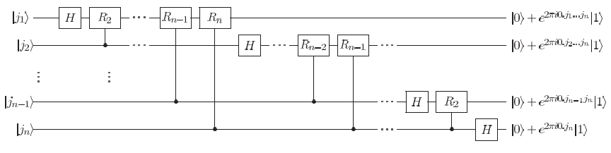

Hidden subgroup problems
================

Quantum computing can efficiently solve *hidden subgroup problems* (HSPs) for finite Abelian groups. Given a group \(G\), a subgroup \(H\leq G\), and a set \(X\), we say a function \(f:G\rightarrow X\) *hides* the subgroup \(H\) if \(f\) is constant on the cosets of \(H\), while it is different between the different cosets of \(H\). HSP is to determine a generating set of \(H\) using \(f\) as an oracle.

Simon's algorithm, quantum Fourier transformation, quantum phase estimation are all solutions to specific HSPs. We will demonstrate these algorithms using isQ examples.

* [Simon's algorithm](#simon)

* [Quantum Fourier transformation](#qft)

* [Quantum phase estimation](#qpe)

* [Shor's algorithm](#shor)

</br>
<h2 id = "simon"></h2>

Simon's algorithm
--------------------

Given a function \(f:\{0,1\}^n\rightarrow\{0,1\}^n\) with the promise that, for some unknown \(s\in\{0,1\}^n\), for all \(x,y\in\{0,1\}^n\),
\[f(x)=f(y)\text{ if and only if }x\oplus y\in\{0^n,s\}\]
where \(\oplus\) denotes bitwise XOR. The goal is to identify \(s\) by making as few queries to \(f(x)\) as possible. Note that
\[a\oplus b=0^n\text{ if and only if }a=b\]
Furthermore, for some \(x\) and \(s\) in \(x\oplus y=s\), \(y\) is unique (\(\neq x\)) if and only if \(s\neq0^n\). This means that \(f\) is two-to-one when \(s\neq0^n\), and one-to-one when \(s=0^n\). It is also the case that \(x\oplus y=s\) implies \(y=s\oplus x\), meaning that
\[f(x)=f(y)=f(x\oplus s)\]
which shows how \(f\) is periodic.

The quantum circuit used in Simon's algorithm is:


The measurement result of the first register \(y\) satisfies
\[y\cdot s=0\]
Therefore, by executing the circuit \(O(n)\) times, we can get a list of independent bitstrings \(y_1,\cdots,y_{n-1}\). With the help of a classical computer, we can calculate \(s\).

Next, we compose an example of Simon's algorithm in isQ. We choose \(n=4\) and thus \(0\leq x<16\). Let \(f(x)=x\) (mod 8). Therefore, if \(f(x) = f(y)\) and \(x\neq y\), \(x\) differs from \(y\) only by the highest bit, i.e., \(x=y\oplus8\) and \(s=8\) (1000 as a bitstring). The complete code is as follows:
```c++
import std;

// g(x) = g(x + 8)
oracle bool[4] g(bool a[4]) {
    bool res[] = [a[0], a[1], a[2], false];
    return res;
}

procedure main(){
    qbit q[4], res[4];
    H(q);
    g(q, res);
    H(q); 
    print M(q);
}
```
We executed the program several times, and the first three outputs are 1, 3, and 6. It is easy to check that they are independent bitstrings. The only 4-bit bitstring \(s\) that satisfies \(s\oplus1=0\), \(s\oplus3=0\), and \(s\oplus6=0\) is 8, precisely the secret bitstring we defined.

</br>
<h2 id = "qft"></h2>

Quantum Fourier transformation
--------------------

Quantum Fourier transform (QFT) is the quantum analogue of the discrete Fourier transform. It is a key component of many HSP solutions, such as Shor's algorithm.

QFT is a linear operator with the following action on the basis states:
\[|j\rangle\mapsto\frac{1}{N}\sum_{k=0}^{N-1}e^{2\pi ijk/N}|k\rangle\]
where \(N=2^n\) and \(n\) is the number of qubits. Equivalently, QFT can be given by the following product representation:
\[|j_1,\cdots,j_n\rangle\mapsto\frac{\left(|0\rangle+e^{2\pi i0.j_n}\right)\left(|0\rangle+e^{2\pi i0.j_{n-1}j_n}\right)\cdots\left(|0\rangle+e^{2\pi i0.j_1j_2\cdots j_n}\right)}{2^{n/2}}\]
where \(j_1,\cdots,j_n\) is the binary representation of \(j\), and \(0.j_lj_{l+1}\cdots j_m\) represents the binary fraction \(j_l/2+j_{l+1}/4+\cdots+j_m/2^{m-l+1}\).

Inspired by the product representation, we use the following quantum circuit to implement QFT:

where
\[R_k\equiv\begin{bmatrix}
1 & 0\\
0 & e^{2\pi i/2^k}
\end{bmatrix}\]
Note that extra SWAP gates are needed at the end of the circuit to reverse the order of the qubits.

The isQ program describing the above circuit is:
```c++
import std;

procedure R(int k, qbit q) {
    double phase = pi / 2 ** (k - 1);
    ctrl GPhase(phase, q);
} deriving gate

procedure qft(qbit q[]) {
    int len = q.length;
    for i in len-1:-1:-1 {
        H(q[i]);
        for j in 0:i {
            ctrl R(i-j+1, q[j], q[i]);
        }
    }
    for i in 0:len/2 {
        SWAP(q[i], q[len-i-1]);
    }
}

// The inverse of qft
procedure qft_inv(qbit q[]) {
    int len = q.length;
    for i in 0:len/2 {
        SWAP(q[i], q[len-i-1]);
    }
    for i in 0:len {
        for j in 0:i {
            ctrl inv R(i-j+1, q[j], q[i]);
        }
        H(q[i]);
    }
}
```
Note that `ctrl` is a keyword that turns a gate into its controlled form, and its first `qbit` argument is the control qubit. `deriving gate` is a keyword that turns a procedure into a quantum gate. Measurement, branch, and loops cannot be used in such a procedure. `.length` is another keyword that acquires the length of an array. The inverse of QFT, named `qft_inv`, is also defined here. It will be used in the following examples.


</br>
<h2 id = "qpe"></h2>

Quantum phase estimation
--------------------

The quantum phase estimation (QPE) algorithm is a quantum algorithm to estimate the phase (or eigenvalue) of an eigenvector of a unitary operator. More precisely, given a unitary matrix \(U\) with an eigenvector \(|u\rangle\), such that
\[U|u\rangle=e^{2\pi i\theta}|u\rangle\]
The algorithm estimates the value of \(\theta\) with high probability.

The overall structure of the QPE algorithm is as follows:


First, \(H^{\otimes n}\) gates are applied to \(|0\rangle^{\otimes n}\) to create the superposition of all numbers in \([0,2^n)\). Then, the superposition controls the gate \(U^j\) so that
\[\frac{1}{2^n}\sum_{j=0}^{2^n-1}|j\rangle|u\rangle\mapsto\frac{1}{2^n}\sum_{j=0}^{2^n-1}e^{2\pi ij\theta}|j\rangle|u\rangle\]

After that, applying the inverse of QFT (\(FT^{-1}\)) to the first register results in a state similar to \(|2^n\theta\rangle\). For simplicity, we will not analyze the error.

The detailed circuit is shown as follows:


We choose \(U=Rz(\theta)\) whose eigenvector is \(|0\rangle\) and \(\theta=2\pi\times23/2^6\approx2.258\). The corresponding isQ program is as follows:
```c++
import std;
import qft; // include qft_inv

int x = 23;
int n = 6;

double theta() {
    return 2 * pi * x / (2 ** n);
}

procedure U(double theta, qbit q) {
    X(q);
    ctrl GPhase(theta, q);
    X(q);
} deriving gate

procedure pow2_ctrlU(int n, qbit anc, qbit ev) {
    double t = theta() * (2 ** n);
    ctrl U(t, anc, ev);
}

int phase_estimation(int n, qbit ev) {
    qbit anc[n];
    for i in 0:n {
        H(anc[i]);
        pow2_ctrlU(i, anc[i], ev);
    }
    qft_inv(anc);
    return M(anc);
}

procedure main()
{
    qbit ev; /* ev is |0>, the eigen vector of U */
    print phase_estimation(n, ev);
}
```
Note that \(FT^{-1}\) (`qft_inv`) is defined in `qft.isq` and not shown here. After execution, the printed result is 23, the phase we set.

</br>
<h2 id = "shor"></h2>

Shor's algorithm
--------------------

Shor’s algorithm is one of the most well-known quantum algorithms and finds the prime factors for input integer \(N\) in polynomial time. This algorithm could break public-key schemes since they are based on the assumptions that factoring large integers is computationally intractable.

To factor a composite number \(N\), Shor's algorithm is summarized below:

1. If \(N\) is even, return the factor 2.

2. Determine whether \(N=a^b\) for integers \(a\geq1\) and \(b\geq2\), and if so return the factor \(a\).

3. Randomly choose \(x\) in the range 1 to \(N-1\). If gcd\((x,N)>1\) then return the factor gcd\((x,N)\).

4. Use the order-finding subroutine to find the order \(r\) of \(x\) modulo \(N\). The \textit{order} \(r\) is the minimal positive integer so that \(x^r(\bmod N)=1\).

5. If \(r\) is even and \(x^{r/2}\neq-1(\bmod N)\) then compute gcd\((x^{r/2}-1, N)\) and gcd\((x^{r/2}+1, N)\), and test to see if one of these is a non-trivial factor, returning that factor if so. Otherwise, the algorithm fails.

Note that, in these steps, only Step 4 is conducted on a quantum machine. We will also focus on this part. The quantum circuit used for finding the order is


which is quite similar to the one used in QPE. The key reason that leads to this similarity is that the state defined by
\[\left| {{u}_{s}} \right\rangle\equiv\frac{1}{\sqrt{r}}\sum\limits_{k=0}^{r-1}{\exp \left( \frac{-2\pi isk}{r} \right)}\left| {{x}^{k}}\bmod N \right\rangle\]
is an eigenvector of gate \(x^j\bmod N\) with the eigenvalue \(\exp(2\pi is/r)\). Therefore, we can infer \(r\) by estimating the phase.

When implementing the quantum part of Shor's algorithm, the most challenging part is implementing the *modular exponentiation* gate, which is detailed in the previous [tutorial](../arith/index.html). Its cost is \(O(n^3)\). Therefore, the cost of order finding and Shor's algorithm is also \(O(n^3)\).

Next, we use isQ to demonstrate finding the factors of 15 following Shor's algorithm. In the order-finding step, we select \(x=7\) and try to find its order using a quantum circuit.

```c++
// |0> -> |r> where 7 ^ r = 1 (mod 15)
int find_order(qbit k[6]) {
    qbit a[4];
    H(k);
    X(a[0]);    // set |a> = |1>
    pow7mod15(k, a);
    qft_inv(k);
}

procedure main()
{
    qbit k[6];
    find_order(k);
    bp;     // check the amplitude of the state vector
    print M(k);
}
```

After executing the program, four results can be printed with equal possibilities: 0, 16, 32, and 48. When the returned value is 16 or 48, we can get the fraction \(32/64=1/4\) or \(48/64=3/4\). Thus, the order is 4, i.e., \(7^4(\bmod15)=1\). Otherwise, we cannot infer the order, and the program needs to be executed again. Since gcd\((7^{4/2}-1, 15)=3\), we finally get 3 as a factor of 15.
