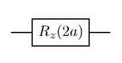
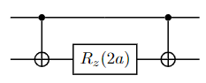
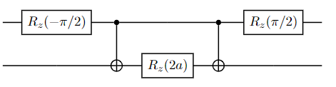
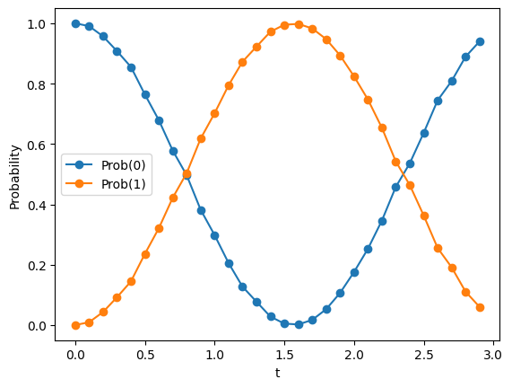
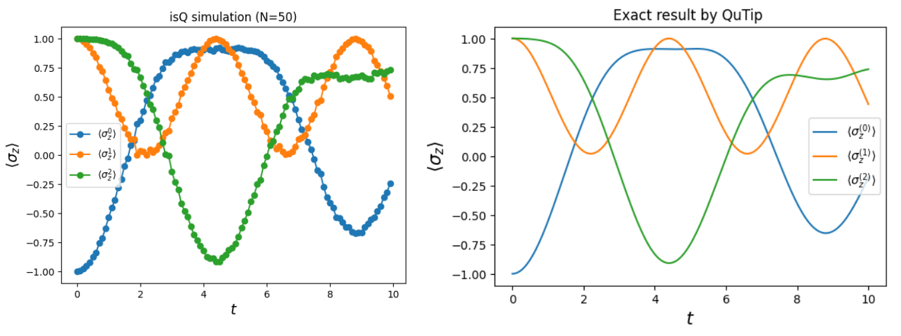
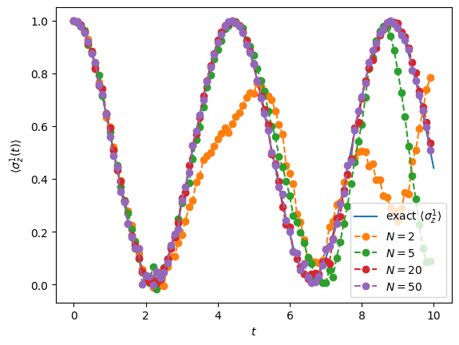
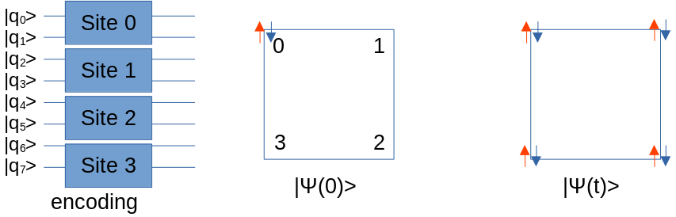
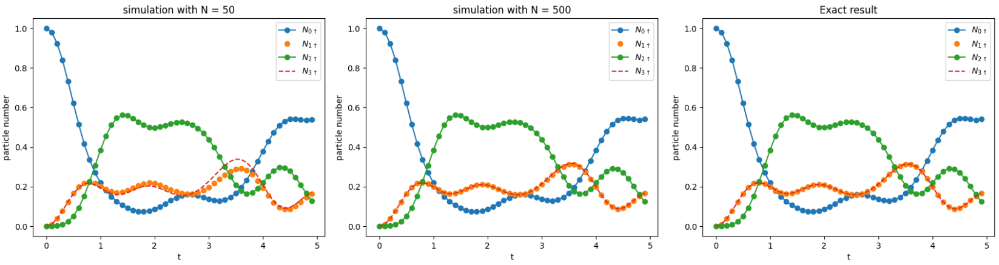

Hamiltonian simulation
=======================


Spin model 
----------------

### Wavefunction evolving with time  
For a quantum system with Hamiltonian \(H\), its wavefunction is evolving as \(|\psi(t)\rangle = e^{-i\int dt H(t)} |\psi(0)\rangle\), where we have assume that \(\hbar=1\). If we further have \(H\ne H(t)\), then we have \(|\psi(t)\rangle = e^{-i H t} |\psi(0)\rangle = \sum_ie^{-iE_i t}\langle i|\psi(0)\rangle|i\rangle\), where we have used the spectral decomposition of \(H=\sum_i E_i |i\rangle\langle i|\). This usually needs us to obtain a diagonalization of \(H\). Practically, a more efficient way [1] to simulate the time evolution is used if we have an efficient way to implement operators directly. Here we recall its major ideal.

For any Hamiltonian in the form of \(H=\sum_k h_k\), we have \(e^{-iHt}=( e^{-iH\tau} )^N\), where \(\tau=t/N\) for some large \(N\) and therefore \(\tau\to0\). Then we have the following approximation:  
$$e^{-i\sum_k h_k \tau}\approx \prod_k e^{-i h_k \tau}.$$  
So the basic element for simulating the whole Hamiltonian is to simulate each term \(e^{-i h_k \tau}\).

### Basic gates in spin model 
In spin model, the Hamiltonian can be represented as $$H= \sum _{ij;mn}\lambda^{mn}_{ij}\sigma_i^m \sigma_j^n, $$
where \({\{\sigma_i^m}\}=\{I,X,Y,Z\}\) at each spin site \(m\). Correspondingly the basic gate we need to implement in the circuit is in the form of \(e^{i \theta \sigma_i \sigma_j}\) for the pair of any two sites.


#### \(e^{i a \sigma}\) gate implementation
We first consider the term \(e^{i a Z}\) on one site. The corresponding implementation is given by 



Similarly, we can directly implement \(e^{i a X}\) and \(e^{i a Y}\) by Rx and Ry. These terms represent the effect of the magnetic field in each direction. 

#### \(e^{i a \sigma_i^m \sigma_j^n}\) gate implementation
This is a two-spin interaction with action \(\sigma_i\) on one site \(m\) and \(\sigma_j\) on the other site \(n\). We first consider the term \(e^{i a ZZ}\).
This term represents an Ising type of interaction between two spins. Its implementation is given by:  



For this gate, we can calculate the output state of each input state in \(\{ |00\rangle,|01\rangle,|10\rangle,|11\rangle\}\) and see that it is equivalent to \(e^{iaZZ}\). Based on this gate, we can easily implement other types. For implementing \(e^{iaXZ}\), for instance, we can use the transformation \(XZ =(U^+ZU)Z=U^+ZZU\), where \(U=Ry(\frac{\pi}{2})\) acting on the first qubit (spin). Its implementation is shown by  



By the same spirit, we can implement any \(\sigma_i^m\sigma_j^n\) terms.

In [demoLib](https://www.arclightquantum.com/isq-example/demoLib.zip), we can use 4 parameters to represent all kinds of spin interactions (including single-spin interaction and any two-spin interaction). We will see that later in an example. 


### Example: Single spin in the magnetic field

Consider a system with Hamiltonian \(H=X\), for input state \(|\psi\rangle=|0\rangle\), the evolution of the wavefunction is give by

$$|\psi(t)\rangle= e^{-it}\frac{1}{\sqrt{2}}|+\rangle +e^{it}\frac{1}{\sqrt{2}}|-\rangle =  \cos t |0\rangle - i \sin t |0\rangle .$$

We then simulate this process by quantum circuit. Following is the content in the isQ file `spin_singleX.isq`. 

```c++
//spin_singleX.isq
import std;
import physics.spin;

procedure main(int N[], double t[]) {
    qbit Q[1];

    // allocate resources for variables 
    double F[100];
    bool B[100];
    int I[100];

    Initialization(F,B,I); // initialized calculation

    // set interactions       type     para1     para2     value            
    appendInteraction(F,B,I,   0,       0,        0 ,       1.0  );

    TimeEvolutionDeploy (F,B,I, Q,  t[0] ,  N[0] ); 
    M(Q);
}
```
In this example, there is only one interaction, so we only call  `appendInteraction` once. The list of all possible interactions is given by:
```
    Interaction types 

    0 : X           i = para1
    1 : Y           i = para1
    2 : Z           i = para1
    3 : XX          i = para1, j = para2
    4 : XY          i = para1, j = para2
    5 : XZ          i = para1, j = para2
    6 : YY          i = para1, j = para2
    7 : YZ          i = para1, j = para2
    8 : ZZ          i = para1, j = para2
```
As can be seen in the code, `type=0` represents the magnetic field in the x-direction. It needs only one position parameter `i`, so para2 can be anything (here we set 0). We can compile this file by `isqc compile spin_singleX.isq`, after which we should obtain a `.so` file `spin_singleX.so`. The `.so` file can be sent to the simulator. One should notice that this file needs two additional parameters \(N\) and \(t\).

Here we use a local simulator to test the result. isQ contains a default quantum simulator. More information about it can be found via `isqc simulate --help`. Here we include some Python scripts to simplify the code. The following Python code runs the circuit many times to collect the data. 

```py
import demoLib
import numpy as np
import matplotlib.pyplot as plt

# load local simulator
sim = demoLib.simulator("spin_singleX.so")

N = 1 # N = 1 in Suzuki decomposition
T = np.arange(0,3.0,0.1) # range of t for plot
Y0 = []
Y1 = []
for t in T:
    res = sim.runCircuit(F=[t],I=[N],shots=5000)
    p0 = sim.calculate( res=res, func = lambda l: int(l[0] == 0) )
    p1 = sim.calculate( res=res, func = lambda l: int(l[0] == 1) )
    Y0.append(p0)
    Y1.append(p1)

plt.plot(T,Y0,'-o',label='Prob(0)')
plt.plot(T,Y1,'-o',label='Prob(1)')
plt.xlabel("t")
plt.ylabel("Probability")
plt.legend()
```
The first line `import demoLib` is used to load the auxiliary package. The simulator needs an input of the so file. `sim.runCircuit` will run the circuit to obtain the measurement. The function `sim.calculate` is used to calculate any observable  
\(\langle \hat{O}\rangle=\langle \psi|\hat{O}|\psi\rangle=\sum_i p_io_i\), where \(o_i=\langle i| \hat{O} |i\rangle\). 
The meaning of arguments passed in `sim.calculate` may be less obvious. One needs to input a definition of a function:
```py
def func(list l) -> float:
    ...
    return 
```
`l` contains each bit value 0 or 1. The result is shown as follows:  

 

### Example: Spin chain model 
We now study a less trivial model whose Hamiltonian is given by   
$$H = h\sum_{n}Z_n+\sum_{n}[J_{x}^{(n)}X_nX_{n+1}+J_{y}^{(n)}Y_nY_{n+1}+J_{z}^{(n)}Z_nZ_{n+1}].$$  
The first term represents a uniform magnetic field on the system. The second term represents complex XYZ interactions. This model has very important applications in condensed matter physics.

In this demo, we set up a 3-site system. Parameters are set as \(h=-1\), \(J_x=-0.2\), \(J_y=-0.3\), and \(J_z=-0.1\). Here we do not consider the connection between the first and third sites. One interested in periodic boundary conditions can set additional interaction. In addition, in the beginning, we set the first spin in the state \(|1\rangle\) while others are in \(|0\rangle\). The isQ code file to translate this circuit is `spin_chain.isq` whose content is shown by   
```c++
// spin_chain.isq
import std;
import physics.spin;

procedure main( int N[], double t[] ) {
    qbit Q[3]; //spin chain contains 3 sites

    // allocate resource for variables 
    double F[100];
    bool B[100];
    int I[100];

    // initialized calculation
    Initialization(F,B,I);

    // first qubit in |1>, others are |0>
    X(Q[0]);

    // set interactions       type     para1     para2     value              
    appendInteraction(F,B,I,   2,       0,        0 ,      -1.0  ); //hz0 
    appendInteraction(F,B,I,   2,       1,        0 ,      -1.0  ); //hz1 
    appendInteraction(F,B,I,   2,       2,        0 ,      -1.0  ); //hz2

    appendInteraction(F,B,I,   3,       0,        1 ,      -0.2  ); //jx01
    appendInteraction(F,B,I,   3,       1,        2 ,      -0.2  ); //jx12

    appendInteraction(F,B,I,   6,       0,        1 ,      -0.3  ); //jy01
    appendInteraction(F,B,I,   6,       1,        2 ,      -0.3  ); //jy12 

    appendInteraction(F,B,I,   8,       0,        1 ,      -0.1  ); //jz01
    appendInteraction(F,B,I,   8,       1,        2 ,      -0.1  ); //jz12

    TimeEvolutionDeploy (F,B,I, Q,  t[0] ,  N[0] ); 
    M (Q);
}
```
Correspondingly, we calculate \(\langle \sigma_z^i (t) \rangle\) at the end. The corresponding Python script is 
```c++
import demoLib
import numpy as np
import matplotlib.pyplot as plt

# load local simulator
sim = demoLib.simulator("spin_chain.so")


N = 20 # N = 1 in Suzuki decomposition
T = np.arange(0,10.0,0.1) # range of t for plot
Z0,Z1,Z2 = [],[],[]

for t in T:
    res = sim.runCircuit(F=[t],I=[N],shots=5000)
    z0 = sim.calculate(res=res, func = lambda l: 1-l[0]*2)
    z1 = sim.calculate(res=res, func = lambda l: 1-l[1]*2)
    z2 = sim.calculate(res=res, func = lambda l: 1-l[2]*2)
    Z0.append(z0)
    Z1.append(z1)
    Z2.append(z2)

plt.plot(T,Z0,'-o',label='$\\langle \sigma_0 \\rangle$')
plt.plot(T,Z1,'-o',label='$\\langle \sigma_1 \\rangle$')
plt.plot(T,Z2,'-o',label='$\\langle \sigma_2 \\rangle$')

plt.legend()

plt.xlabel(r'$t$',size=15)
plt.ylabel(r'$\langle\sigma_z\rangle$',size=15)
plt.title(f'Dynamics of a Heisenberg spin chain (N={N})');
```  
The result is shown as follows  



As a comparison, an exact calculation by [QuTip](https://qutip.org/) is shown in the figure. The precision can further increase by increasing \(N\). To be more clear, we check \(\langle\sigma_z^1(t)\rangle\) more carefully by the following figure.  

  

As shown in the figure, for \(N=2\) case, in a small time regime the result of the calculation matches the exact result very well. However, at large t regime, to obtain a better result we need a larger \(N\).

### Any other spin mode

One can easily extend the code to make a circuit to simulate an arbitrary spin model with more complicated interaction types. For any (2-local) spin system, we can represent it as \(H=\sum_k \xi_k \sigma_{i(k)}^{m(k)} \sigma_{j(k)}^{n(k)}\). For each \(k\), we can use at most 4 parameters (Type \(_k\), \(\xi_k\), \(m_k\), \(n_k\)) to specify the term. 


Fermion-Hubbard model
----------------------

The Hubbard model is one of the most important systems in condensed matter physics. Studying this model will reveal much exotic physics in strongly correlated electron systems such as superconductivity and quantum Hall effect. In this tutorial, we study the time evolution of a wave function in the system with such a Hamiltonian. 

### Hamiltonian
We start from a most general Hamiltonian given by \(H=H_0+H_I\) where 
$$ H_0=\sum_{ij}t_{ij}c_{i}^{\dagger}c_{j}$$
and   
$$H_I=\sum_{ijkl}u_{ijkl}c_{i}^{\dagger}c_{j}^{\dagger}c_{k}c_{l}.$$ 
For a system with spins, the indices \(i\) and \(j\) should also be implicit. \(H_0\) represents the single particle terms, such as onsite energy and hopping terms. \(H_I\) contains many-body terms. For example, if we set \(i=k\) and \(j=l\), we obtain the Coulomb interaction 
$$H_U = U\sum_i n_{i\uparrow} n_{i\downarrow}.$$
In the most general case, \(H_I\) can consider other interactions, such as Hund's interaction, and is written as 
$$H_I = H_U + H_J + ...$$ 
In the standard Hubbard, we consider \(H_0\) and \(H_U\). Nevertheless, the following discussion is also suited for other two-particle interactions.

Our task is to find an encoding method to transform this Hamiltonian into one with Pauli tensors only. 
By Jordan–Wigner transformation \(c_{i}=\sigma_{i}^{-}\prod_{\alpha<i}\left(-Z_{\alpha}\right)\), the diagonal term of \(H_0\) is given by 
$$t_{ii}c^\dagger_i c_i = \frac{t_{ii}}{2}\left(1+Z_{i}\right),$$
the hopping term (off-diagonal term) is given by 

$$\begin{aligned}
    t_{ij}c^\dagger_{i}c_j+t_{ji}c^\dagger_jc_i=
    -\chi_{ij}X_{2-}^{i}Y_{2+}^{j}\mathcal{Z}_{ij}X_{2+}^{i}Y_{2-}^{j}
    -\xi_{ij}X_{2-}^{i}X_{2-}^{j}\mathcal{Z}_{ij}X_{2+}^{i}X_{2+}^{j}\\
    -\xi_{ij}Y_{2+}^{i}Y_{2+}^{j}\mathcal{Z}_{ij}Y_{2-}^{i}Y_{2-}^{j}
    +\chi_{ij}Y_{2+}^{i}X_{2-}^{j}\mathcal{Z}_{ij}Y_{2-}^{i}X_{2+}^{j},\\
\end{aligned}$$  
where \(\chi_{ij}= i\frac{t_{ij}-t_{ji}}{2}\frac{\left(-1\right)^{j-i}}{2}\), \(\xi_{ij}=\frac{t_{ij}+t_{ji}}{2}\frac{\left(-1\right)^{j-i}}{2}\), and 
$$\mathcal{Z}_{ij}= Z_i\otimes Z_{i+1}...\otimes Z_{j},$$
and \(X_{2\pm} = R_x (\pm\frac{\pi}{2} )\), and \(Y_{2\pm}=R_y(\pm\frac{\pi}{2})\). 
For real \(t_{ij}\) case, we have \(\chi_{ij}=0\). Finally the Coulomb interaction is given by 
$$H_U=\frac{U}{4}\left(1+Z_{j}+Z_{i}+Z_{i}Z_{j}\right).$$

### Example
In the following, we will give an example step by step showing coding with isQ. This example needs one to download the package [demoLib](https://www.arclightquantum.com/isq-example/demoLib.zip) first. Let us start!  

Let study a 4-site system with Hamiltonian given by
$$H=t\sum_{i=1}^{3}(c^\dagger_{i\sigma}c_{i+1\sigma}+h.c.)-\mu\sum_{i\sigma} c^\dagger_{i\sigma } c_{i\sigma}+U\sum_{i}c^\dagger_{i\uparrow}c_{i\uparrow}c^\dagger_{i\downarrow}c_{i\downarrow},$$



where we have defined \(i=4\) means \(i=0\). Therefore, the hopping terms are acting like a ring. Since there is the spin degree of freedom, we need to use 2 qubits to represent a single site in the Hubbard model. Therefore, we need to define 8 qubits by
```c++
qbit Q[8]; 
```
We set the parameters as \(t=-1.0\), \(\mu=1.0\), \(U=2.0\). The tedious progress for deploying \(e^{-iHt}\) is packaged inside `demoLib`. For instance, setting the hopping term between site 0 and site 1 is done by one-line code:
```c++
appendHubbardInteraction_Hopping(F, B, I, 0, 1, t); 
``` 
where `F`, `B`, and `I` are source spaces, and the user need not care about it. The 4-th and 5-th variables represent the hopping sites. The last variable pass in the value of `t`. As we can see, by our lib it is very easy to set a term in Hamiltonian. We set initial state \(|\psi(T=0)\rangle\) as full filling the first site, as shown in Figure. The corresponding code is 
```c++
X(Q[0]);
X(Q[1]);
```
Then we would like to study the wavefunction at any time \(T\). A full code that is runnable is given by
```c++
// hubbard_main.isq
import std;
import physics.hubbard;

procedure main(int intPara[] , double douPara[]) {
    int N;
    double T;
    double t, U, m; // parameters in Hubbard model
    qbit Q[8]; // use 8 qubit to encode 4 sites in Hubbard model

    // allocate resource for storing Hamiltonian
    double F[100]; 
    bool B[1];
    int I[200];
    Initialization(F,B,I); // start calculation

    t = -1.0; // hopping term
    U =  2.0; // Coulomb U term
    m = -1.0; // onsite energy

    N = intPara[0]; // time slides  
    T = douPara[0]; // evolution time

    // set there is a spin up particle on each site as the initial state
    X(Q[0]);
    X(Q[1]);

    // set interactions                 
    appendHubbardInteraction_Hopping(F,B,I,   0, 1,  t ); //hopping between (0,1)
    appendHubbardInteraction_Hopping(F,B,I,   1, 2,  t ); //hopping between (1,2)
    appendHubbardInteraction_Hopping(F,B,I,   2, 3,  t ); //hopping between (2,3)
    appendHubbardInteraction_Hopping(F,B,I,   0, 3,  t ); //hopping between (0,3)

    appendHubbardInteraction_OnSite(F,B,I, 0, m); // onsite energy on site 0
    appendHubbardInteraction_OnSite(F,B,I, 1, m); // onsite energy on site 1
    appendHubbardInteraction_OnSite(F,B,I, 2, m); // onsite energy on site 2
    appendHubbardInteraction_OnSite(F,B,I, 3, m); // onsite energy on site 3 

    appendHubbardInteraction_CoulombU(F,B,I,  0, U); // U on site 0
    appendHubbardInteraction_CoulombU(F,B,I,  1, U); // U on site 1
    appendHubbardInteraction_CoulombU(F,B,I,  2, U); // U on site 2
    appendHubbardInteraction_CoulombU(F,B,I,  3, U); // U on site 3

    TimeEvolutionDeploy(F,B,I,Q,T,N); // deploy gates on circuit

    M(Q);
}
```   
This code needs 2 input parameters \(N\) and \(T\). \(N\) is the number of time slides and \(T\) is the evolving time. We can compile this code by:
```sh
isqc compile hubbard_main.isq
```
And we can run it with the built-in simulator by (set `T=0.5` and `N=2`)
```sh
isqc simulate hubbard_main.so -i 2 -d 0.5 --shots 500
```
To visualize the result, we calculate the particle number of spin up on each site at any time. To plot the result, we use a more efficient simulator by the following Python script
```py
import demoLib
import numpy as np
import matplotlib.pyplot as plt
import os 

# load local simulator
sim = demoLib.simulator("hubbard_main.so")

N = 50 # Suzuki decomposition
T = np.arange(0,5.0,0.1) # range of t for plot
Y0,Y1,Y2,Y3 = [],[],[],[],

for t in T:
    res = sim.runCircuit(F=[t],I=[N],shots=5000)
    p0 = sim.calculate( res=res, func = lambda l: int(l[0] == 1) );Y0.append(p0)
    p1 = sim.calculate( res=res, func = lambda l: int(l[2] == 1) );Y1.append(p1)
    p2 = sim.calculate( res=res, func = lambda l: int(l[4] == 1) );Y2.append(p2)
    p3 = sim.calculate( res=res, func = lambda l: int(l[6] == 1) );Y3.append(p3)
    

plt.plot(T,Y0,'-o',label='$N_{0\\uparrow}$')
plt.plot(T,Y1,'o' ,label='$N_{1\\uparrow}$')
plt.plot(T,Y2,'-o',label='$N_{2\\uparrow}$')
plt.plot(T,Y3,'--',label='$N_{3\\uparrow}$')
plt.xlabel("t")
plt.ylabel("particle number")
plt.legend()
plt.title(f'simulation with N = {N}')
```
The results with \(N=50\) and \(N=500\) are shown below. We also calculate the result by exact method (classical simulation). As we can see, for the \(N=50\) case, the result at a small time region agrees with the exact results very well. At the large time region, the time slide \(\tau=T/N\) becomes large, therefore the error increase. As one can see from the geometry of the system, sites 1 and 3 are symmetric, therefore we know that  \(\langle N_{1\sigma}\rangle=\langle N_{3\sigma}\rangle\). To obtain a better result, we can set \(N=500\) as shown in the figure.




**Reference**

1. S. Lloyd. “Universal Quantum Simulators.” *Science* 273 (5278), 1996:1073–78.
2. J. Hubbard. "Electron Correlations in Narrow Energy Bands." *Proc. R. Soc.Lond. A* 276 (1365), 1963: 238–57.
3. P. Jordan and E. Wigner. "Ber Das Paulische Quivalenzverbot." *Z. Physik* 47 (9-10), 1928: 631–51.

