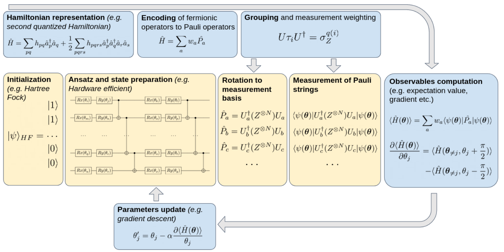
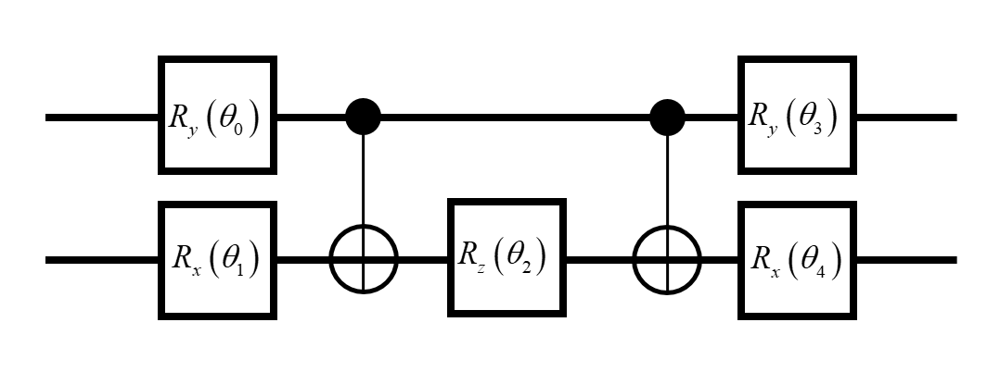

The eigenvalues of the Hamiltonian determine almost all properties in a molecule or material of interest. The ground state for molecule Hamiltonian is of particular interest since the energy gap between the ground state and the first excited state of electrons at room temperature is usually larger. Most molecules are in the ground state.

Here, molecular electronic Hamiltonian is represented as \(\hat{H}\). A trial wave function \(\left| \varphi \left( \theta \right) \right\rangle\) is parameterized with \(\overrightarrow{\theta }\), which is called Ansatz. VQE is represented as follows:

\[\frac{\left\langle  \varphi \left( {\vec{\theta }} \right) \right|\hat{H}\left| \varphi \left( {\vec{\theta }} \right) \right\rangle }{\left\langle  \varphi \left( {\vec{\theta }} \right) \right|\left. \varphi \left( {\vec{\theta }} \right) \right\rangle }\ge {{E}_{0}}\]

\({{E}_{0}}\) is the lowest energy of molecular electronic Hamiltonian \(\hat{H}\). To estimate the \({{E}_{0}}\),  the left-hand side of the equation above is minimized by updating the parameters of the Ansatz \(\left| \varphi \left( \theta \right) \right\rangle\).

The molecular electronic Hamiltonian \(\hat{H}\) has the second quantized form:


\[\hat{H}=\sum\limits_{pq}{{{h}_{pq}}}\hat{a}_{p}^{+}{{\hat{a}}_{q}}+\frac{1}{2}\sum\limits_{pqrs}{{{h}_{pqrs}}}\hat{a}_{p}^{+}\hat{a}_{q}^{+}{{\hat{a}}_{r}}{{\hat{a}}_{s}}\]


It can be mapped to the linear combination of Pauli operator by Jordan-Wigner transformation or Bravyi-Kitaev transformation as follows:


\[\hat{H}=\sum\limits_{\alpha }{{{\omega }_{\alpha }}{{{\hat{P}}}_{\alpha }}}\]

Then, we can calculate the expectation of Hamitonian \(\hat{H}\) with respect to Ansatz \(\left| \varphi \left( \theta \right) \right\rangle\) by designing quantum circuit.  Finally, updating the parameters in the Ansatz \(\left| \varphi \left( \theta \right) \right\rangle\)  quantum circuit to get the \({{E}_{0}}\) the lowest energy of molecular electronic Hamiltonian.

The overview of VQE schematic diagram is as follows:



VQE belongs to hybrid quantum-classical algorithms, in which quantum computer is responsible for executing quantum circuit and classical computer is responsible for updating the parameters of quantum gates in the Ansatz \(\left| \varphi \left( \theta \right) \right\rangle\). The lowest energy of molecular electronic Hamiltonian \(\hat{H}\)  can be obtained and the wave function corresponding to \({{E}_{0}}\).

To show the algorithm flow, we take the solution for molecule hydrogen's lowest energy as an example in the following code. After Jordan-Wigner transformation in a minimal basis molecule hydrogen Hamiltonian is

\[\begin{align}& {{{\hat{H}}}_{JW}}=-0.81261I+0.171201\sigma _{0}^{z}+0.171201\sigma _{1}^{z}-0.2227965\sigma _{2}^{z}-0.2227965\sigma _{3}^{z} \\ & +0.16862325\sigma _{1}^{z}\sigma _{0}^{z}+0.12054625\sigma _{2}^{z}\sigma _{0}^{z}+0.165868\sigma _{2}^{z}\sigma _{1}^{z}+0.165868\sigma _{3}^{z}\sigma _{0}^{z} \\ & +0.12054625\sigma _{3}^{z}\sigma _{1}^{z}+0.17434925\sigma _{3}^{z}\sigma _{2}^{z}-0.04532175\sigma _{3}^{x}\sigma _{2}^{x}\sigma _{1}^{y}\sigma _{0}^{y} \\& +0.04532175\sigma _{3}^{x}\sigma _{2}^{y}\sigma _{1}^{y}\sigma _{0}^{x}+0.04532175\sigma _{3}^{y}\sigma _{2}^{x}\sigma _{1}^{x}\sigma _{0}^{y}-0.04532175\sigma _{3}^{y}\sigma _{2}^{y}\sigma _{1}^{x}\sigma _{0}^{x}\\ \end{align}\]

We used two qubit in this example，the Ansatz \(\left| \varphi \left( \theta \right) \right\rangle\) is:



isQ implements VQE through python. we can first write the Ansatz \(\left| \varphi \left( \theta \right) \right\rangle\) through isQ as：

```c++
import std;

procedure main(int i_par[], double d_par[]){
    qbit q[2];
    X(q[1]);

    Ry(1.57, q[0]);
    Rx(4.71, q[1]);
    CNOT(q[0],q[1]);
    Rz(d_par[0], q[1]);
    CNOT(q[0],q[1]);
    Ry(4.71, q[0]);
    Rx(1.57, q[1]);

    if(i_par[0] == 0){
        M(q[0]);
    }
    if(i_par[0]==1){
        M(q[1]);
    }
    if(i_par[0]==2){
        M(q[0]);
        M(q[1]);
    }
    if(i_par[0]==3){
        Rx(1.57, q[0]);
        Rx(1.57, q[1]);
        M(q[0]);
        M(q[1]);
    }
    if(i_par[0]==4){
        H(q[0]);
        H(q[1]);
        M(q[0]);
        M(q[1]);
    }
}
```

Then, updating parameters through python. In python, the compilation and simulation of isQ can be called through `os.popen`

```
# ground state energy of hydrogen molecule
from numpy.random import rand
from scipy.optimize import minimize
import os
import json

# compile "h2.isq" and generate the qir file "h2.so"
h2_isq = 'h2.isq'
compile_cmd = f"isqc compile {h2_isq}"
res = os.popen(compile_cmd).read()
if res:
    print('compile error')
    print(res)
else:
    print('compile ok!')


h2_sim_file = 'h2.so'

def get_expectation(theta) -> float:  
    '''
    theta: Angle during preparation
    e_n: E_N

    get the expectation value of 
    the Hamiltonian for specific theta
    '''
    theta = float(theta) # float

    hs = [-0.4804, +0.3435, -0.4347, +0.5716, +0.0910, +0.0910]
    # coefficients of the Hamiltonian
    # for more information, see `PHYS. REV. X 6, 031007 (2016)`

    expectations = list() # to store results in a List

    expectations.append(hs[0])
    E_N = 5 
    # The first does not require quantum measurement, which is constant
    # As a result, the other 5 coefficients need to be measured
    # i.e. hs[1], hs[2], hs[3], hs[4], hs[5]

    for e_n in range(E_N):

        # simulate and get the result
        simulate_cmd = f'isqc simulate -i {e_n} -d {theta} --shots 100 {h2_sim_file}'

        res = os.popen(simulate_cmd).read()

        try:

            test_res = json.loads(res)
            expectation = 0 # initialize to 0

            for measure_res in test_res: # test_res is Dict

                frequency = test_res[measure_res]/100 # to get every frequency

                # frequency instead of probability

                parity = (-1)**(measure_res.count('1') % 2) # to get every parity

                # parity checking to get expectation value

                expectation += parity * frequency # to accumulate every expectation result

            expectations.append(hs[e_n+1] * expectation) # The result is multiplied by coefficients
        except:
            print('simulate error') # error
            print(res)
            exit()

    return sum(expectations) # to get the final result of Hamiltonian with `hs`


# nelder-mead optimization of a convex function
# define range for theta

theta_min, theta_max = -3.14, 3.14

# define the starting point as a random sample from the domain
pt = theta_min + rand(1) * (theta_max - theta_min)

# perform the search

result = minimize(get_expectation, pt, method='nelder-mead')

# summarize the result
print(f"Status : {result['message']}")
print(f"Total Evaluations: {result['nfev']}")


# evaluate solution
solution = result['x']
evaluation = get_expectation(solution)
print(f"Solution: H_2({solution}) = {evaluation} Eh")
```

**Reference**

1. J. Tilly, H. Chen, S. Cao, et al. "The variational quantum eigensolver: a review of methods and best practices." *Physics Reports*, 2022, 986: 1-128.
